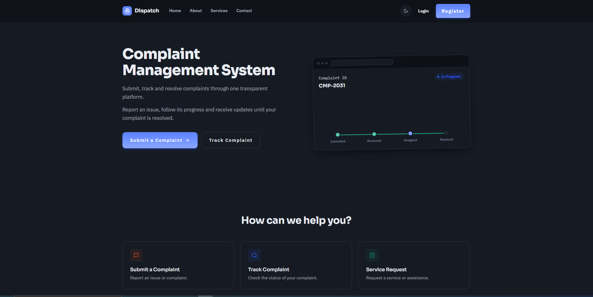
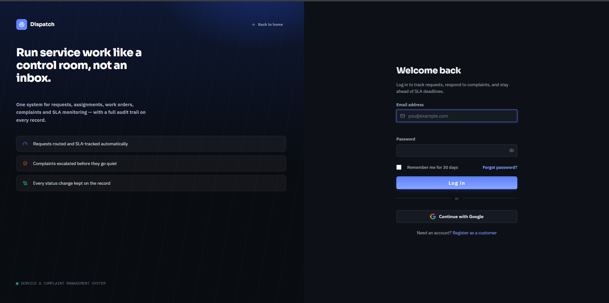
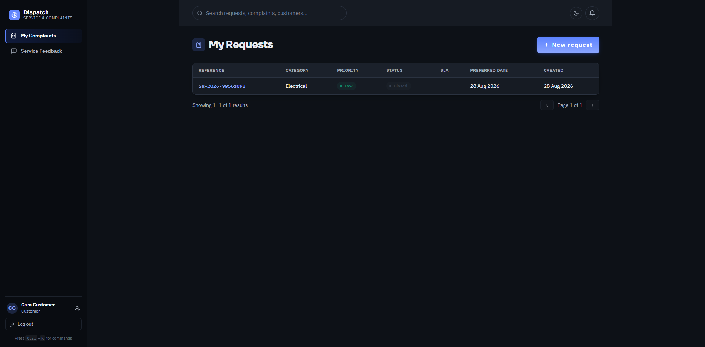
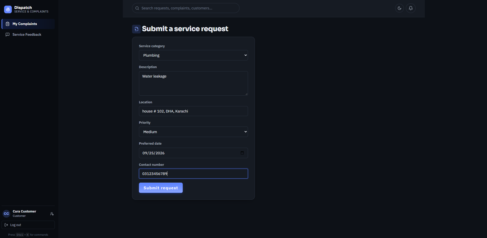
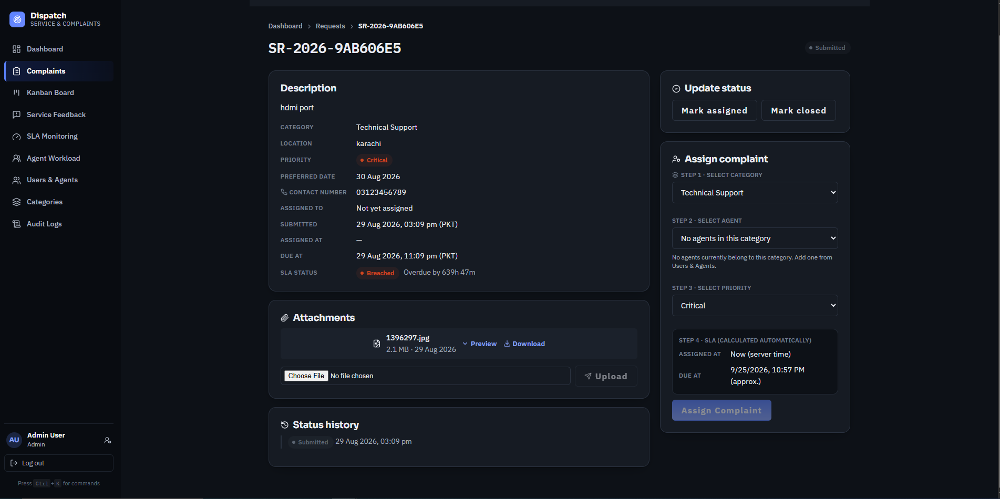
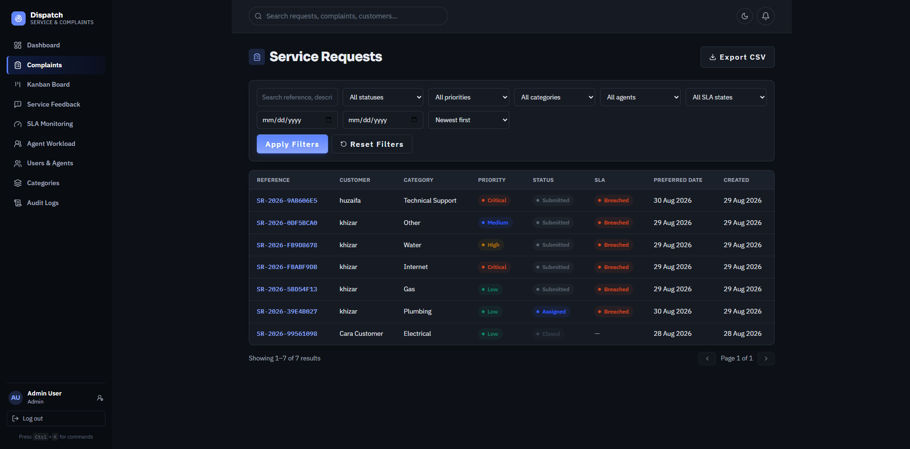
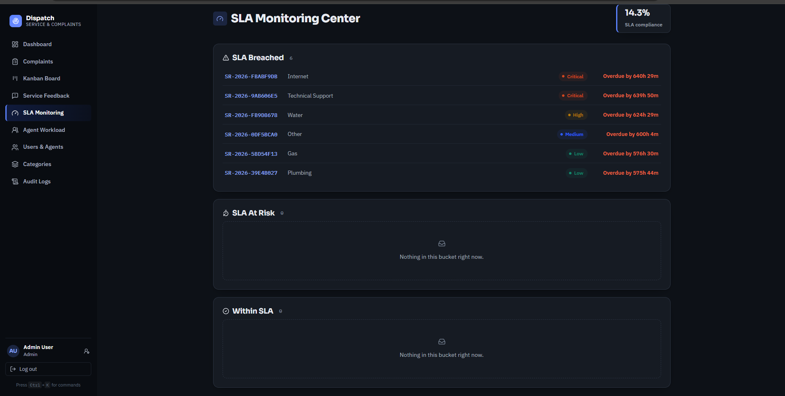
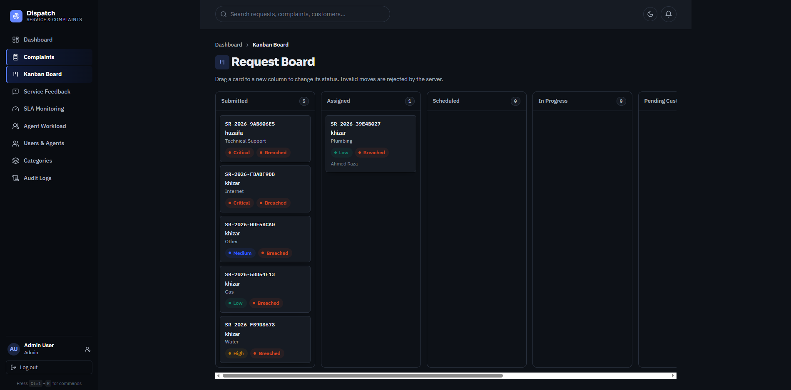
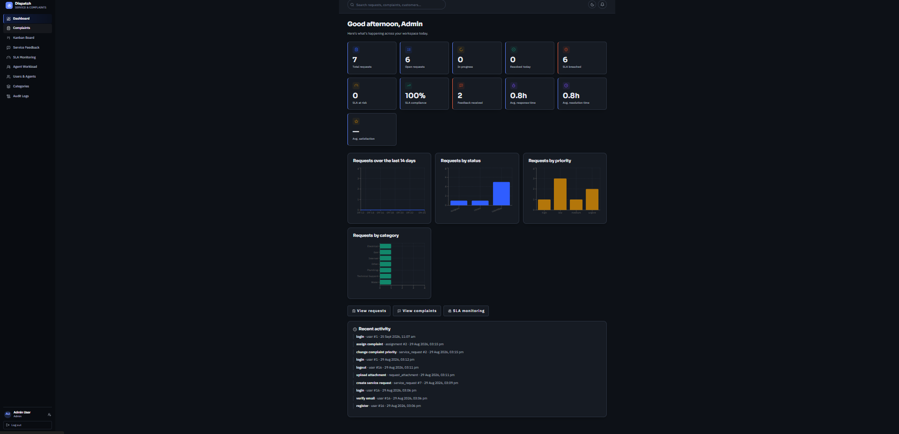

# Professional Service Request & Complaint Management System

A full-stack platform for organizations that provide professional services and need a structured way to receive service requests, assign staff, track work, manage complaints, monitor SLAs, collect documents, and measure service performance.

Built with **React + TypeScript** on the frontend and **Flask REST API** on the backend, with server-side authentication, role-based authorization, object-level authorization, workflow enforcement, secure file handling, and audit logging.

---

## ✨ Overview

The **Professional Service Request & Complaint Management System** provides a centralized platform for managing the complete service lifecycle — from submitting a request to assignment, scheduling, work execution, SLA monitoring, resolution, customer confirmation, and feedback.

The system supports multiple user roles with different permissions and provides dedicated dashboards and workflows for customers, service agents/technicians, supervisors, and administrators.

It is designed with a strong focus on **security, authorization, workflow integrity, service performance, and maintainability**.

---

## 🛠️ Tech Stack

| Layer             | Technologies                                  |
| ----------------- | --------------------------------------------- |
| Frontend          | React, TypeScript, Vite                       |
| Backend           | Python, Flask REST API                        |
| ORM               | Flask-SQLAlchemy                              |
| Database          | PostgreSQL / SQLite                           |
| Authentication    | Flask-Login                                   |
| CSRF Protection   | Flask-WTF / CSRFProtect                       |
| Authorization     | Server-side RBAC + Object-Level Authorization |
| Migrations        | Alembic / Flask-Migrate                       |
| Testing           | Pytest                                        |
| Charts            | Recharts                                      |
| Icons             | Lucide React                                  |
| Email             | SMTP                                          |
| OAuth             | Google OAuth 2.0                              |
| Production Server | Gunicorn                                      |

---

## 🚀 Key Features

### Service Request Management

* Complete service request lifecycle
* Request submission and validation
* Service categories and priorities
* Staff assignment
* Appointment scheduling
* Work orders and work notes
* Request status workflow
* Customer confirmation
* Customer-initiated reopening
* Service feedback

### Complaint Management

* Complaint creation and tracking
* Complaint categories and severity
* Requested resolution
* Complaint workflow
* Escalation management
* Resolution tracking
* Customer interaction and feedback

### SLA Management

* Category and priority-based SLA rules
* Response and resolution deadlines
* SLA breach detection
* At-risk request monitoring
* Live SLA countdowns
* SLA Monitoring Center
* Escalation support

### Dashboards & Operations

* Role-specific dashboards
* KPI cards and charts
* Request and complaint statistics
* Customer 360 view
* Agent workload monitoring
* Kanban workflow board
* Recent activity
* Global search
* Advanced filtering and sorting
* Pagination
* CSV export

### Communication

* Internal messaging
* User notifications
* Unread notification counter
* Email-based OTP verification
* Password recovery
* Optional Google Sign-In

### Security

* Session-based authentication
* CSRF protection
* Server-side RBAC
* Object-level authorization
* BOLA / IDOR protection
* Secure file uploads
* Path traversal protection
* Input validation
* Mass-assignment protection
* Rate limiting
* Restrictive CORS
* Security headers
* Audit logging
* Secure password handling

### Additional Features

* Optional invoicing and payment management
* Customer feedback and ratings
* Generated documents
* Image preview for supported attachments
* Command palette
* Breadcrumb navigation
* Toast notifications
* Confirmation dialogs
* Light / dark / system themes

---

# 📸 Screenshots

The following screenshots demonstrate the main user-facing areas of the application.

## 🏠 Project Overview

### Landing Page



### Login



---

## 👤 Customer Portal

### Customer Dashboard



### Create Service Request



### Request Details



### Complaints



---

## ⚙️ Operations & Administration

### SLA Monitoring Center



### Kanban Board



### Administrator Dashboard



---

# 👥 User Roles

The application provides four primary roles with server-enforced permissions.

| Role                           | Main Capabilities                                                                                                                               |
| ------------------------------ | ----------------------------------------------------------------------------------------------------------------------------------------------- |
| **Customer**                   | Create and manage own requests and complaints, upload attachments, communicate with assigned staff, confirm/reopen resolutions, submit feedback |
| **Service Agent / Technician** | Work on assigned requests, add work orders and notes, upload evidence, update assigned work                                                     |
| **Supervisor**                 | Assign staff, manage workflows and SLAs, resolve escalations, monitor requests and complaints                                                   |
| **Administrator**              | Manage users, service catalog, SLA rules, requests, complaints, audit logs, invoices and payments                                               |

Authorization is enforced on the **backend**, so frontend navigation restrictions are not relied upon as a security boundary.

---

# 🏗️ Architecture

```text
┌──────────────────────────────────────────────┐
│          React + TypeScript Frontend         │
│                   Vite                       │
└───────────────────────┬──────────────────────┘
                        │
                        │ REST API
                        │ Session Cookie
                        ▼
┌──────────────────────────────────────────────┐
│                Flask REST API                │
│                                              │
│  Routes → Services → Models                  │
│                                              │
│  Authentication                              │
│  RBAC + Object-Level Authorization           │
│  CSRF Protection                             │
│  Validation                                  │
│  SLA / Workflow Engine                       │
│  Audit Logging                               │
│  Secure File Handling                        │
└───────────────────────┬──────────────────────┘
                        │
                        │ SQLAlchemy
                        ▼
┌──────────────────────────────────────────────┐
│              Relational Database             │
│                                              │
│       PostgreSQL / SQLite                    │
└──────────────────────────────────────────────┘
```

The frontend communicates with the Flask backend through REST APIs.

Authentication is handled through a server-managed session cookie. Authorization and business rules are enforced by the backend.

For the complete architecture and design details, see:

* [`Architecture Documentation`](docs/architecture.md)
* [`Database Documentation`](docs/database.md)
* [`API Documentation`](docs/api.md)

---

# 📁 Project Structure

```text
.
├── backend/
│   ├── app/
│   │   ├── routes/          API route blueprints
│   │   ├── models/          SQLAlchemy models
│   │   ├── services/        Business and application services
│   │   ├── security/        Authorization and security logic
│   │   └── utils/           Validation and file utilities
│   ├── migrations/          Database migrations
│   ├── tests/               Automated backend tests
│   ├── config.py
│   ├── run.py
│   ├── seed.py
│   └── requirements.txt
│
├── frontend/
│   ├── src/
│   │   ├── components/      Reusable UI components
│   │   ├── context/         Application state
│   │   ├── layouts/         Application layouts
│   │   ├── pages/           Application pages
│   │   ├── routes/          Protected routes
│   │   ├── services/        API services
│   │   ├── types/           TypeScript types
│   │   └── utils/           Frontend utilities
│   ├── package.json
│   ├── tsconfig.json
│   └── vite.config.ts
│
├── docs/
│   ├── api.md
│   ├── architecture.md
│   ├── database.md
│   ├── deployment.md
│   ├── security.md
│   └── screenshots/
│
├── .gitignore
├── LICENSE
└── README.md
```

---

# 📋 Requirements

Before running the project locally, make sure you have:

* **Python 3.11+**
* **Node.js 20+**
* **npm 10+**

For production:

* **PostgreSQL 14+**

SQLite is supported for local development and automated testing.

---

# ⚡ Quick Start

## 1. Clone the Repository

```bash
git clone https://github.com/HuzaifaAIDev/complaint-management-system.git
cd complaint-management-system
```

---

## 2. Backend Setup

Navigate to the backend:

```bash
cd backend
```

Create a Python virtual environment:

```bash
python -m venv .venv
```

### Windows

```powershell
.venv\Scripts\activate
```

### Linux / macOS

```bash
source .venv/bin/activate
```

Install dependencies:

```bash
pip install -r requirements.txt
```

Create the environment file from the example:

```bash
cp .env.example .env
```

Configure the required environment variables in:

```text
backend/.env
```

Run database migrations:

```bash
flask db upgrade
```

Optional: create demo/seed data:

```bash
python seed.py
```

Start the backend:

```bash
flask run
```

or:

```bash
python run.py
```

The backend runs by default at:

```text
http://127.0.0.1:5000
```

---

## 3. Frontend Setup

Open another terminal and navigate to:

```bash
cd frontend
```

Install dependencies:

```bash
npm install
```

Create the environment file:

```bash
cp .env.example .env
```

Configure the API URL if required.

Start the development server:

```bash
npm run dev
```

The frontend runs by default at:

```text
http://localhost:5173
```

To create a production build:

```bash
npm run build
```

---

# 🗄️ Database

### Local Development

SQLite can be used for local development and testing.

Example:

```text
DATABASE_URL=sqlite:///dev.db
```

### Production

PostgreSQL is recommended for production deployments.

Configure the PostgreSQL connection through the `DATABASE_URL` environment variable and run:

```bash
flask db upgrade
```

Database schema changes should be managed through migrations rather than manually recreating the database.

---

# 🔐 Security

Security is a core part of the application architecture.

The system includes:

* OTP-based email verification
* Secure password hashing
* Strong password requirements
* Account lockout controls
* Session-cookie authentication
* CSRF protection
* Server-side RBAC
* Object-level authorization
* BOLA / IDOR protection
* Mass-assignment protection
* Server-side validation
* Secure file upload handling
* Path traversal protection
* Parameterized database queries
* Restrictive CORS
* Security headers
* Rate limiting
* Audit logging
* Protected administrative functionality

For the complete security design and implementation details:

➡️ [`Security Documentation`](docs/security.md)

---

# 🧪 Testing

The backend includes an automated Pytest suite covering authentication, authorization, workflows, file handling, SLA functionality, and enterprise features.

Run the complete test suite:

```bash
cd backend
pytest
```

For verbose output:

```bash
pytest -v
```

Test coverage includes areas such as:

* Authentication
* OTP verification
* Password recovery
* Account security
* RBAC
* Object-level authorization
* BOLA / IDOR
* Service request validation
* Complaint workflows
* SLA rules
* Status transitions
* File upload security
* Dashboard authorization
* Search authorization
* CSV export authorization
* Cross-account resource protection

---

# 📚 Documentation

Detailed technical documentation is available in the `docs/` directory.

| Documentation                          | Description                                                  |
| -------------------------------------- | ------------------------------------------------------------ |
| [`API Documentation`](docs/api.md)     | API endpoints, authentication, roles, requests and responses |
| [`Architecture`](docs/architecture.md) | Application architecture and design                          |
| [`Database`](docs/database.md)         | Database structure and relationships                         |
| [`Security`](docs/security.md)         | Security controls and implementation                         |
| [`Deployment`](docs/deployment.md)     | Production deployment guidance                               |

---

# 🚀 Deployment

For production deployment instructions, see:

➡️ [`Deployment Documentation`](docs/deployment.md)

The recommended production setup uses:

```text
Users
  │
  ▼
HTTPS / Reverse Proxy
  │
  ├──────────────► React Static Build
  │
  └──────────────► Gunicorn
                       │
                       ▼
                    Flask API
                       │
                       ▼
                   PostgreSQL
```

Production deployments should use HTTPS, secure environment variables, PostgreSQL, a production WSGI server, appropriate CORS configuration, secure session cookies, and protected file storage.

---

# 📌 Project Highlights

This project demonstrates practical implementation of:

* Full-stack web application development
* REST API design
* React + TypeScript development
* Flask backend development
* Relational database design
* Authentication and authorization
* RBAC and object-level access control
* Secure file handling
* Workflow/state-machine enforcement
* SLA management
* Automated testing
* API documentation
* Production deployment planning
* Security-focused application design

---

# 📄 License

This project is licensed under the **MIT License**.

See the [`LICENSE`](LICENSE) file for the complete license text.

---

# 🔗 Repository

**GitHub:**
https://github.com/HuzaifaAIDev/complaint-management-system
